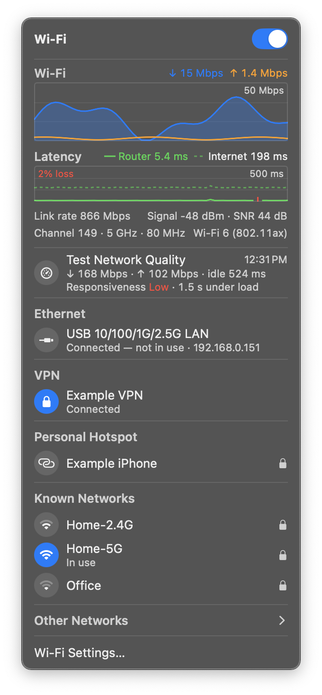

# NetIndicator

A macOS menu bar app that replaces the system Wi-Fi menu and also shows whether your traffic is going over **Ethernet** or **Wi-Fi**.



*Shown with the built-in sample data (`./build.sh --demo --open`).*

- **Icon**: a cable when Ethernet is in use, Wi-Fi bars (with signal strength) when Wi-Fi is in use, a slashed icon when Wi-Fi is off. A VPN is looked through, so the icon shows the physical link underneath.
- **Panel** (left-click), styled after the Sequoia Wi-Fi menu: Wi-Fi on/off switch, live graphs, Ethernet and VPN status, Personal Hotspot, Known Networks, Other Networks (collapsible), Other… (join a hidden network), Wi-Fi Settings…
- **Live graphs** under the switch, following whichever link is in use:
  - Speed: download (blue area) and upload (orange line) over the last 60 seconds.
  - Latency: router (solid) and internet (dashed, `1.1.1.1`) ping once a second, with packet loss. Shows "Router blocked" when a VPN stops the Mac reaching the local network.
  - Details: Wi-Fi link rate, signal, SNR, channel and standard; or Ethernet link speed, duplex and IP.
- **Test Network Quality** (row under the graphs): runs Apple's built-in `networkQuality` test (under a minute, a few hundred MB of data) and shows download and upload capacity, idle latency, and responsiveness — how much delays grow while the line is busy. Click again to stop. Through a VPN it measures the VPN.
- **Personal Hotspot** lists only hotspots you can join right now: saved (password on file) or open, heard in the last 30 seconds with a usable signal. Other people's iPhones go under Other Networks.
- **Right-click** (or Control-click): Launch at Login, Network Settings…, Quit.

## Install

Requires macOS 13 or later; runs natively on Intel and Apple Silicon.

1. Download `NetIndicator-<version>.zip` from [Releases](https://github.com/CalumTai/NetIndicator/releases/latest), unzip it, and move `NetIndicator.app` to Applications.
2. Open it. The app isn't notarized by Apple, so macOS blocks the first launch: go to **System Settings → Privacy & Security**, scroll down and click **Open Anyway**. (Or run `xattr -dr com.apple.quarantine /Applications/NetIndicator.app` in Terminal.)
3. Click **Allow** when it asks for Location access, so it can show network names.
4. Optional: hide the system Wi-Fi icon in **System Settings → Control Center → Wi-Fi**, and turn on **Launch at Login** from NetIndicator's right-click menu.

## Build from source

```bash
./build.sh
```

Compiles `Sources/*.swift` with `swiftc` for both Intel and Apple Silicon, assembles `NetIndicator.app`, ad-hoc signs it, installs it to `~/Applications` and launches it. Re-run after any change. Needs the Xcode Command Line Tools. A locally built app skips the Open Anyway step.

- `./build.sh --demo --open` launches with sample data and the panel open — handy for checking the layout without touching real networks.
- `./build.sh --package` writes the release zip to `.build/` without installing anything. The version number is set at the top of `build.sh`.

## Location permission

macOS hides Wi-Fi network names from apps that don't have Location access, so the app asks for it on first launch. Without it, the icon, Wi-Fi switch, and Ethernet/VPN status still work, but the network list shows an "Allow Location Access…" row instead of names. The app never reads or stores your location.

Because the app is ad-hoc signed, macOS may ask again after a rebuild.

## Where the data comes from

| What | Source |
|---|---|
| Which link is in use | `NWPathMonitor` (Network framework) |
| Wi-Fi power, current network, signal, scanning, joining | CoreWLAN |
| Saved networks | `networksetup -listpreferredwirelessnetworks` |
| Joining a saved network when CoreWLAN wants the password | `networksetup -setairportnetwork` (uses the saved keychain password) |
| VPN name | `scutil --nc list` |
| Speed graph | Kernel per-interface byte counters (`sysctl NET_RT_IFLIST2`), sampled every second, always |
| Latency graph | ICMP echo over an unprivileged socket, once a second while the panel is open; router address from the interface's IPv4 service state |
| Wi-Fi details | CoreWLAN `transmitRate`, `rssiValue`, `noiseMeasurement`, `wlanChannel`, `activePHYMode` (no Location needed) |
| Ethernet details | `ifconfig <interface>` media line |
| Network quality test | `/usr/bin/networkQuality`, summary output parsed |

Personal Hotspot is approximated: Apple's Instant Hotspot needs entitlements only Apple's own apps can hold (`com.apple.wifi.tether.browse`), so the app can't show the phone's cellular signal or battery, or wake a hotspot remotely. It finds hotspots with the regular scan plus a targeted check (one every 2 seconds while the panel is open) for each saved iPhone/iPad hotspot the scan missed.

## Debugging

```bash
/usr/bin/log show --last 10m --predicate 'subsystem == "local.netindicator"'
```

Logs scan counts, Wi-Fi power changes, join results and Location status (counts and errors only, no network names).
